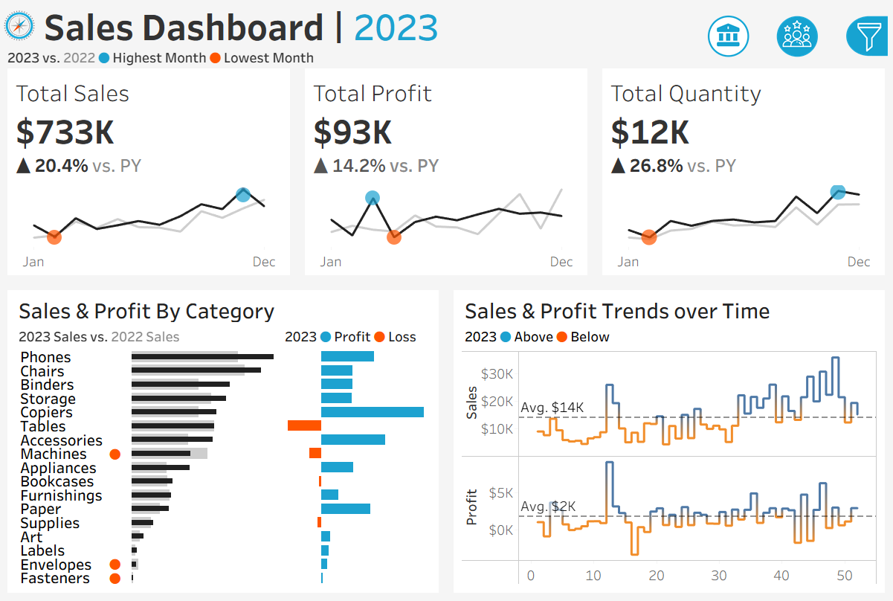

# Sales & Customer Analytics Dashboard

**Interactive Tableau dashboards analyzing 2023 sales and customer performance metrics**

---

## 📊 Overview

This project provides a comprehensive view of sales and customer behavior through two interactive Tableau dashboards. Built to support data-driven decision-making, the dashboards track key performance indicators, trends, and segmentation across products and customers for 2023.

**Key Metrics:**
- **Total Sales:** $733K (↑20.4% YoY)
- **Total Profit:** $93K (↑14.2% YoY)
- **Total Quantity Sold:** 12K units (↑26.8% YoY)
- **Total Customers:** 693 (↑8.6% YoY)
- **Total Orders:** 1,687 (↑28.3% YoY)

---

## 🎯 Dashboards

### 1. Sales Dashboard
Analyzes revenue, profit, and quantity trends with category-level granularity.

**Features:**
- **Executive KPIs:** Total Sales, Profit, Quantity with YoY % change
- **Trend Analysis:** Monthly sales and profit trends (2023 vs. 2022)
- **Category Performance:** Sales and profit breakdown across 15+ product categories (Phones, Chairs, Binders, Storage, etc.)
- **Loss/Profit Segmentation:** Identifies high-profit categories (Copiers: +$8K) and loss-making products (Machines, Tables, Supplies)
- **Time-Series Insights:** Weekly sales and profit fluctuations with average benchmarks ($14K sales avg., $2K profit avg.)



---

### 2. Customer Dashboard
Focuses on customer acquisition, order behavior, and high-value customer identification.

**Features:**
- **Customer Metrics:** Total Customers, Sales Per Customer ($1,058 avg.), Total Orders
- **Order Distribution:** Histogram showing customer segments by order frequency (1–8 orders)
- **Top 10 Customers:** Ranked leaderboard by 2023 profit, last order date, and order count
- **Retention Signals:** Month-over-month customer and order trends
- **Behavioral Insights:** 400 customers placed 1–2 orders; high-frequency buyers (3+ orders) drive significant revenue


---

## 🛠️ Tech Stack

- **Visualization:** Tableau Public
- **Data Format:** CSV (included in `/data` folder)

---

## 📁 Repository Structure

```
tableau-sales-customer-insights/
├── data/
│   └── sales_data.csv              # Source dataset
├── workbooks/
│   ├── SalesDashboard.twbx         # Sales dashboard workbook
│   └── CustomerDashboard.twbx      # Customer dashboard workbook
├── images/
│   ├── Sales-Dashboard.jpg         # Sales dashboard screenshot
│   └── Customer-Dashboard.jpg      # Customer dashboard screenshot
└── README.md                       # This file
```

---

## 🚀 Live Demo

**[View Interactive Dashboards on Tableau Public →](https://public.tableau.com/app/profile/rachit.agrawalll/viz/SalesDashboard_17613966150120/SalesDashboard)**

Navigate between dashboards using the tabs:
- **Sales Dashboard** – Revenue and product performance
- **Customer Dashboard** – Customer behavior and segmentation

---

## 📈 Key Insights

### Sales Insights
- **Top Revenue Category:** Phones (~$35K in 2023 sales)
- **Highest Profit Margin:** Copiers generated $8K+ profit despite moderate sales
- **Loss Categories:** Tables and Machines showed net losses in 2023
- **Seasonality:** December showed peak sales performance

### Customer Insights
- **Concentration Risk:** Top 10 customers contributed ~$80K profit (approx. 86% of total)
- **Order Frequency:** 400 customers (58%) are single- or two-time buyers
- **High-Value Segments:** Raymond Buch (#1: $14K profit), Hunter Lopez (#2: $10.5K profit)
- **Growth Opportunity:** 39 customers placed 5+ orders, suggesting strong retention potential

---

## 🔧 How to Use

### Option 1: View on Tableau Public
Click the live demo link above to interact with filters, drill-downs, and tooltips.

### Option 2: Download and Explore Locally
1. Download the `.twbx` workbook files from `/workbooks`
2. Open in [Tableau Public Desktop](https://public.tableau.com/en-us/s/download) (free)
3. Explore, modify, or extend the analysis

# Clone this repo
git clone https://github.com/<your-username>/tableau-sales-customer-insights.git

```

## 📊 Dataset

**Source:** Sample retail/e-commerce sales data (2022–2023)

**Fields:**
- Order ID, Customer Name, Category, Sub-Category
- Sales, Profit, Quantity
- Order Date, Ship Date
- Region, Segment

> Data is anonymized and intended for portfolio/educational use.

---

## 🎨 Design Highlights

- **Clean Layout:** Minimal clutter, focus on KPIs and trends
- **YoY Comparison:** Built-in 2023 vs. 2022 benchmarks with % change indicators
- **Interactive Filters:** Click categories, time periods, or customer segments to drill down
- **Color Coding:** Blue = above-average performance, Orange = below-average or losses

---

## 🤝 Contributing

Suggestions and improvements are welcome! Feel free to:
- Open an issue for bugs or feature requests
- Fork the repo and submit a pull request
- Share feedback via [LinkedIn](https://linkedin.com/in/rachitagrawalll)

---

## 👤 Author

**Rachit Agrawal**  
Product Analyst | Data Visualization Specialist  

- 📧 [rachitag.03@gmail.com](mailto:rachitag.03@gmail.com)  
- 💼 [LinkedIn](https://linkedin.com/in/rachitagrawalll)  
- 📊 [Tableau Public](https://public.tableau.com/app/profile/rachit.agrawalll)  
- 💻 [GitHub](https://github.com/rachitagrawal03)

---

## 🙏 Acknowledgments

- Dataset inspired by common retail analytics use cases
- Built with [Tableau Public](https://public.tableau.com/)

---

**⭐ If you found this helpful, please star the repo!**
